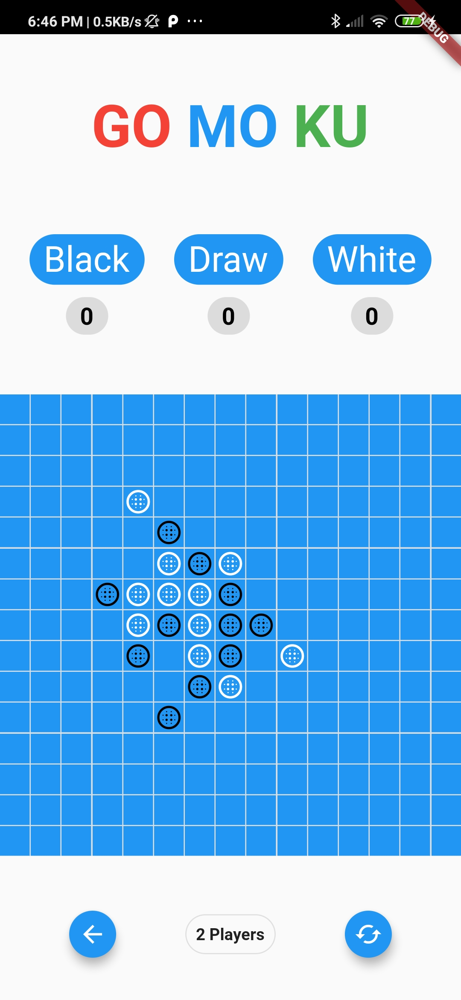

##  Gomoku Game

#### gomoku implementation without AI

 

**Gomoku** is an abstract strategy board game also known as **Gobang** or **Five in a Row**, and it is traditionally played with Go pieces (black and white stones) on a go board with 15x15 cells; because once placed, pieces are not moved or removed from the board, gomoku may also be played as a paper and pencil game. The game is known in several countries under different names.
